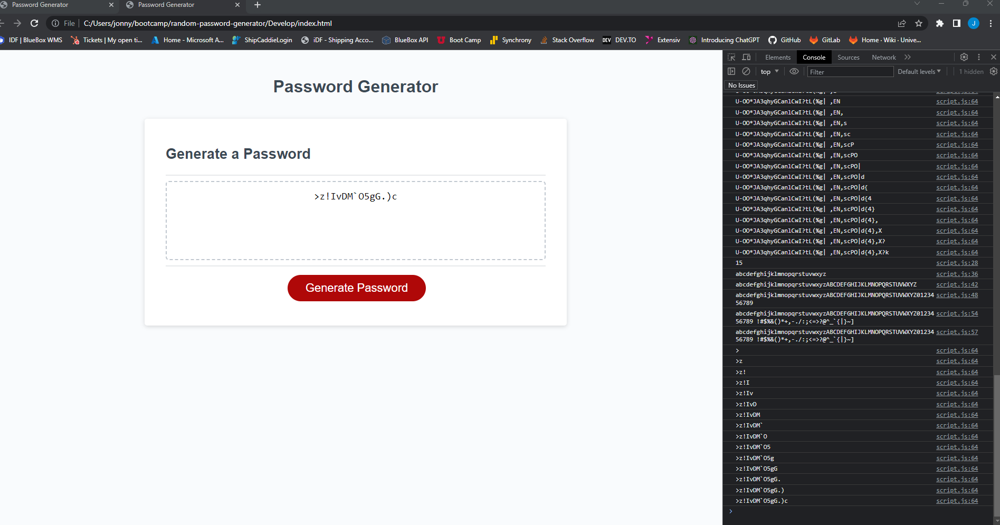

# random-password-generator
Mini project to create a random password generator based on input from user and specific password criteria

I think my last homework notes said I needed to include a screenshot in my readme file.  I tried to do that above.  

This was a good project.  I struggled through many things and found help online and through ask BCS as mentiond in the notes in the .js file.  